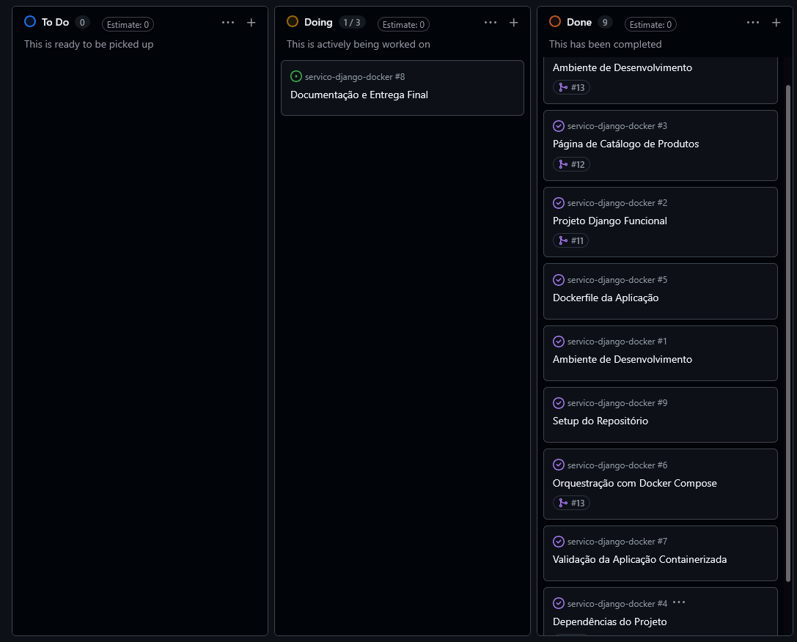

# Serviço Django Dockerizado

Aplicação web simples desenvolvida em Django, containerizada com Docker e orquestrada via Docker Compose.

## 📋 Sobre o Projeto

O objetivo deste projeto é disponibilizar um serviço web (página de "Catálogo de Produtos") empacotado em um container Docker, com toda a orquestração automatizada via `docker-compose`.

## 🛠️ Tecnologias Utilizadas

- Python 3.10
- Django
- SQLite (banco de dados padrão)
- Docker
- Docker Compose

## ✅ Pré-requisitos

Antes de rodar a aplicação, você precisa ter instalado na sua máquina:

- [Docker](https://docs.docker.com/get-docker/)
- [Docker Compose](https://docs.docker.com/compose/install/) (já incluso no Docker Desktop)
- Git (para clonar o repositório)

## 🚀 Como Rodar a Aplicação

1. Clone o repositório:
   ```bash
   git clone https://github.com/seu-usuario/servico-django-docker.git
   cd servico-django-docker
   ```

2. Suba a aplicação com o Docker Compose:
   ```bash
   docker-compose up --build
   ```

3. Acesse a aplicação no navegador:
   ```
   http://localhost:8000
   ```

4. Para parar a aplicação, pressione `CTRL+C` no terminal e, se necessário, rode:
   ```bash
   docker-compose down
   ```

## 📁 Estrutura do Projeto

```
servico-django-docker/
├── core/                  # Projeto Django
├── Dockerfile             # Definição da imagem do container
├── docker-compose.yml     # Orquestração do serviço web
├── requirements.txt       # Dependências do projeto
├── .gitignore
└── README.md
```

## 🗂️ Processo Ágil
 
O desenvolvimento foi organizada em um quadro Kanban (GitHub Projects) com as colunas **To Do**, **Doing** e **Done**.
 
**Print do quadro Kanban:**
 
